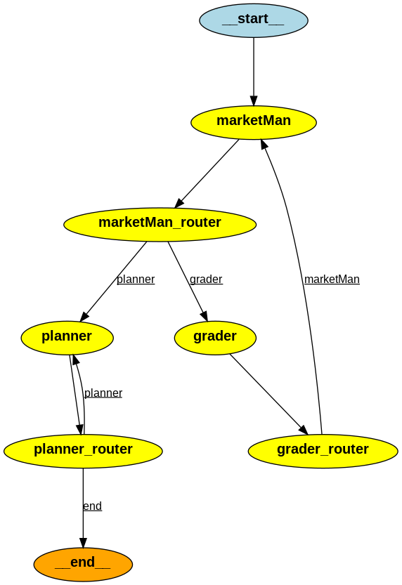

# Project Plan LangGraph

Simple multi-agent workflow to do market research, and provide user detailed-plan to complete each step of market research.

## Workflow



## Agents

Workflow majorly includes three agents :

* **MarketMan** : To generate all the steps involved in market research for the user query.
* **Planner** : To generate a detailed plan to complete steps involved in market research.
* **Grader** : To do reflection (rethinking/feedback-loop) of the generated responses and provide feedback for better generation.

## Aim

The main aim of the project is to explore the capabilities of LLM(gpt-3.5-turbo) to generate schematic responses with function-calling capabilities that can further be used for better UI, for example, we used the schematic responses shown in the CLI example. 

---

### Modules
* [structure.py](structure.py) : Response Schema for each agent and workflow-state is defined in this module.
* [agents.py](agents.py) : Each agent's temepelate and agent itself are defined in this module.
* [graph.py](graph.py) : Every component(agents,routers,edges) are stiched together with LangGraph framework in this module.

### How to use
* Step 1: Install requirements <br>

  ```
  pip install -r requirements.txt
  ```
* Step 2 : Set OpenAI-API key in [agents.py](agents.py#L40) file
  
  ```python
  api_key = "sdk-xxxxxxxxxxxxxxxxxxxxxxx"
  ```
* Step 3 : Run [CLI program](cl_inference.py)
  * Windows
    ```
    python cl_inference.py
    ```
  * Linux
    ```
    python3 cl_inference.py
    ```
